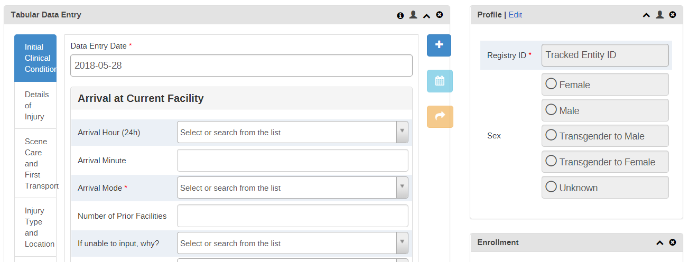

# WHO Emergency, Trauma, and Acute Care program
The WHO ETA program is built to use all vanilla DHIS2 modules and does not rely on any external dependencies. It was built on version 2.28.

## Naming conventions
* `ETA_`
 + dataElements
* `ETA `
 + optionSets
 + programIndicators
 + indicators (aggregate)

## Structure and Data Entry
The ETA program is structured in a series of stages using Tracker Capture.  The stages allow for a "tabular" interface for the user to toggle between sections of the form for data entry as well as support one to many relationships for some repeat sections such as medical interventions.

Each stage has the proper data elements associated along with a program stage section to control the order of the data elements.  The section names also provide headers for the tabular view.

### Tabular View
The tabular interface can be enabled using a privileged account by pressing the settings button in the top right of the tracked entity dashboard page.

Select "Tabular Data Entry" from the list of options and turn off timeline data entry.  This should only need to be set when moving to a new instance of DHIS2 as the setting is not migrated with the program metadata export.

The final view should look like this:

### Display Logic
The tracker capture entry interface has a series of display conditions to help guide the data entry users to only enter the necessary data and avoid potential incorrect entries.  Since the ETA program is built using only vanilla DHIS2, all of the display logic is controlled using program rules.

#### Logic naming convention
* `Hide ...` Hides data element(s) and/or section(s) based on the stated logic criteria.
* `Show ...` Shows data element(s) and/or section(s) based on the stated logic criteria.
* `Validate ...` Checks if a data element value has been entered correctly.

#### Program Rule Variables
All of the program rule variables should mimic the same data element or tracked entity attribute name stripped of any spaces.  For example, the data element `ETA_Prior Facility Interventions` would have a corresponding programRuleVariable called `ETA_PriorFacilityInterventions`.

#### Core/Extended Flag
Most of the program rules are stand alone and can fire whenever necessary.  There is one special rule based on the Tracked Entity Attribute `Core/Extended Dataset` that controls if a user sees a simplified set of data elements for entry or the complete set.  The rule is used to hide all of the extended data elements with a series of programRuleActions.  This might be possible using category combination disaggregations on the form; however, due to the integrated nature of the form where some data values are always present and some are only present for 'extended', we chose to use program rules instead.

## Analytics

### Program Indicators
The program indicators form the foundation for almost all of the analysis objects within the ETA program.  
