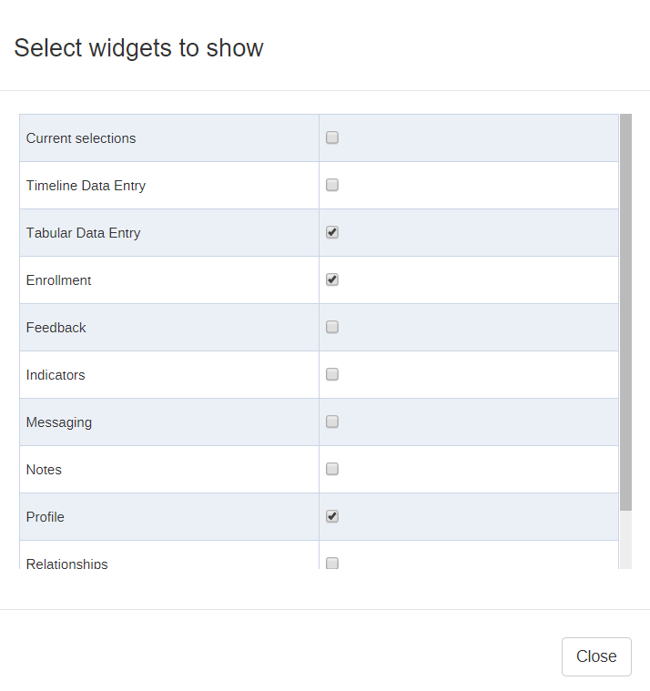

# WHO Emergency, Trauma, and Acute Care program
The WHO ETA program is built to use all vanilla DHIS2 modules and does not rely on any external dependencies. It was built on version 2.28.

## Naming conventions
* `ETA_`
  * dataElements
* `ETA `
  * optionSets
  * programIndicators
  * indicators (aggregate)

## Structure and Data Entry
The ETA program is structured in a series of stages using Tracker Capture.  The stages allow for a "tabular" interface for the user to toggle between sections of the form for data entry as well as support one to many relationships for some repeat sections such as medical interventions.

Each stage has the proper data elements associated along with a program stage section to control the order of the data elements.  The section names also provide headers for the tabular view.

### Tabular View
The tabular interface can be enabled using a privileged account by pressing the settings button in the top right of the tracked entity dashboard page.

Select "Tabular Data Entry" from the list of options and turn off timeline data entry.  This should only need to be set when moving to a new instance of DHIS2 as the setting is not migrated with the program metadata export.

The final view should look like this:

### Display Logic
The tracker capture entry interface has a series of display conditions to help guide the data entry users to only enter the necessary data and avoid potential incorrect entries.  Since the ETA program is built using only vanilla DHIS2, all of the display logic is controlled using program rules.

#### Logic naming convention
* `Hide ...` Hides data element(s) and/or section(s) based on the stated logic criteria.
* `Show ...` Shows data element(s) and/or section(s) based on the stated logic criteria.
* `Validate ...` Checks if a data element value has been entered correctly.

#### Program Rule Variables
All of the program rule variables should mimic the same data element or tracked entity attribute name stripped of any spaces.  For example, the data element `ETA_Prior Facility Interventions` would have a corresponding programRuleVariable called `ETA_PriorFacilityInterventions`.

#### Core/Extended Flag
Most of the program rules are stand alone and can fire whenever necessary.  There is one special rule based on the Tracked Entity Attribute `Core/Extended Dataset` that controls if a user sees a simplified set of data elements for entry or the complete set.  The rule is used to hide all of the extended data elements with a series of programRuleActions.  This might be possible using category combination disaggregations on the form; however, due to the integrated nature of the form where some data values are always present and some are only present for 'extended', we chose to use program rules instead.

## Analytics

### Program Indicators

#### General Indicators
The program indicators form the foundation for almost all of the analysis objects within the ETA program.  Because Tracker does not allow for category option disaggregations on individual data elements, we had to make program indicators with age filters to match the age buckets specified.  

The name format is `dataElement name` - `optionSet value` `age bucket`.  If you inspect the expressions, you'll see a format of `dataElement` == `optionSet value` && `age` == `agebucket`.  They all follow the same format.  Injury mechanism combines two data elements together and stitches them together with an || before the age filter.

#### Severity Scores
The other main type of indicator is for severity scores.  In general, these follow a formula specified by the scoring system.  See the metadata worksheet for links to the formulas.

### Aggregate Indicators
The aggregate indicators use program indicators as inputs.  The `... Patient Count` indicators use a program indicator in the numerator and 1 for a denominator.  The `... Patient %` indicators use the related program indicator in the numerator and the related total program enrollment for that age group in the denominator.  The main reason these exist is to make it easier for a user to find information in one place instead of having to know that some data are stored in data elements, some in program indicators, and some in regular indicators.  It also makes it easier for the severity score and patient characteristics reports to pull information just using indicator groups instead of individual indicator references in the query.

### Custom Reports
The custom reports are in the `custom_reports` folder.  Most of these are "audit filters" which narrow down patients to just those with a specific criteria for manual chart review.  The reports use a jQuery get request (or requests) to the analytics and events endpoints to get the list of patients.  The results are either combined or intersected and the final patched patient registry ids are displayed in a table for the report.  

All of the javascript is embedded in the report itself so it is self contained provided the metadata has been configured with the same ids.  The only external dependency is bootstrap for some of the formatting on the table.

## User Roles and Groups
### Roles:
* ETA Data Entry: Has access to Tracker Capture app and analytics apps (Visualizer, Pivot Tables, Reports, Dashboards).  Can create/update/delete enrollments and tracker data values.
* ETA Analysis: Has access to Visualizer, Pivot Tables, Reports, Dashboards.

### Groups:
* ETA: admin accounts and all objects are shared with it
* ETA Data Entry: Can see all dashboards except the MOH Dashboard
* ETA Analysis Only: Can see all dashboards except the Audit Filters

## Migration Considerations
* Do a full metadata dependency export for the ETA program.  
* Then stitch in all aggregate indicators and indicator groups that begin with 'ETA '.  
* Do a metadata dependency export for each of the dashboards.

## Areas for Improvement
UI/UX- The program rules are messy.  When we started, we didn't anticipate so many flow control type logic rules on the entry form itself.  If the form continues to require additional display logic, it might be better to scrap the program rules and build a custom entry form to handle the logic in a better fashion.  The underlying stage structure will still allow for a one patient to many interaction setup and a custom form could have _all_ of the flow control desired instead of most.  

Custom reports- I'm more of a Python/R programmer than javascript, so the custom reports could be optimized.  Specifically, the patient characteristics could be reprogrammed to be entirely laid out with javascript code instead of having a base html structure already laid out.  That would allow the form to update if new indicators are added to one of the relevant indicator groups.
